# Twitter Clone Created using Django
A fully functional web applications with the Twitter UI and functionality.

Implemented using: Django, HTML, CSS, JQuery

## Table of Contents
- [Current functionality](#current-functionality)
  - [Create an account](#create-an-account)
  - [Log In / Logout](#log-in--logout)
  - [Tweets](#tweets)
  - [Home Page](#home-page)
  - [Search](#search)
  - [Profile](#profile)
  - [Settings](#settings)
- [Planned Features](#planned-features)
- [Set Up](#set-up)
  - [Notes](#notes)

## Current functionality
### Create an account
- Users sign up with a username, email, and password
- Users can create a display name and bio
- Users can upload a profile picture and cover banner picture 

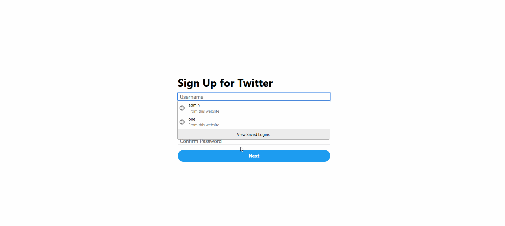

### Log In / Logout
- Users can login using thier username and email
- If you forget your password, it can be reset by entering your email
- You can logout by clicking the bottom left button with your username on it

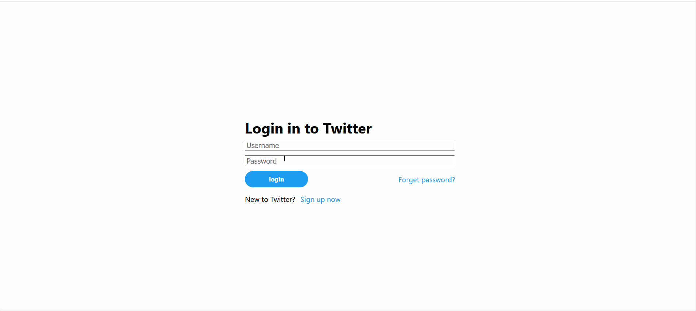

### Tweets
- You can like, retweet, and reply to tweets
- You can reply and see the full tweet conversation by clicking on the tweet
- You can post tweets by clicking the Post button on the left, or at the top of the Home Page
- You can delete your own tweets by clicking on the ellipse
- Message will pop up at the bottom of the page when a tweet has been successfully posted or deleted

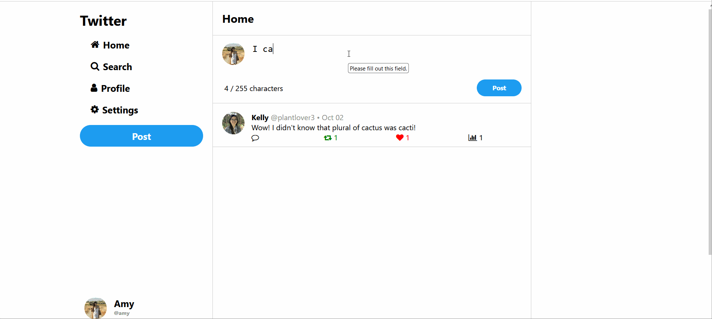
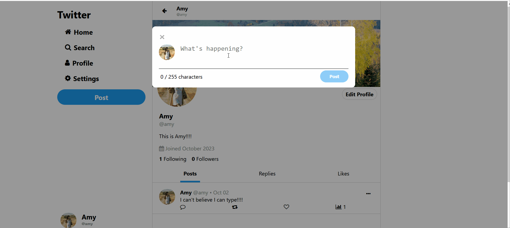
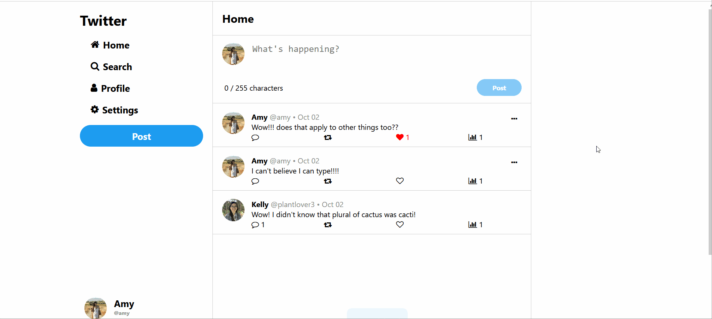
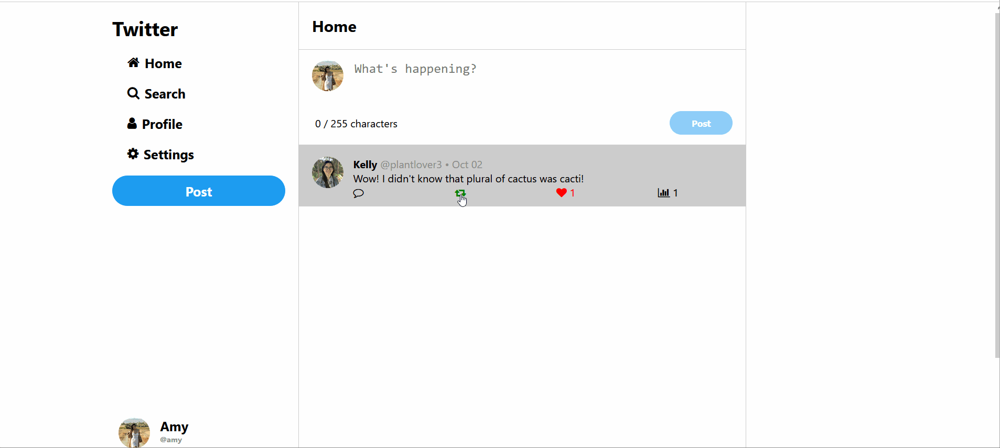
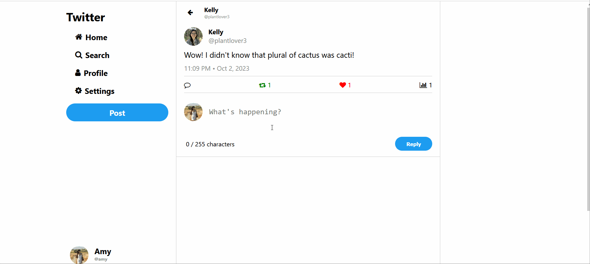

### Home Page
- Your homepage consists of all posts created or retweeted by you and those you follow

### Search
- Users can search for other users by their username or display name
- Users can serach for tweets based on the tweet contents

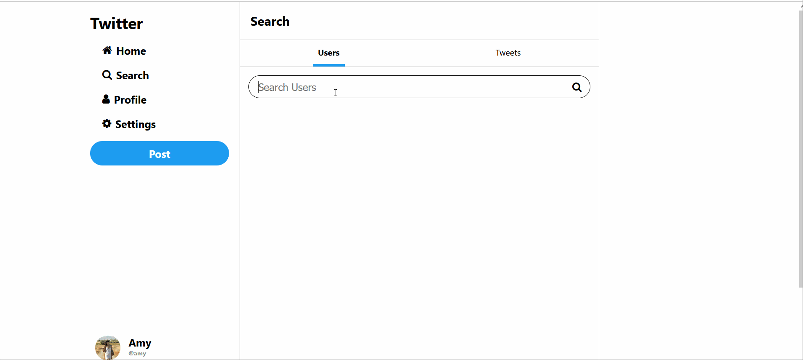
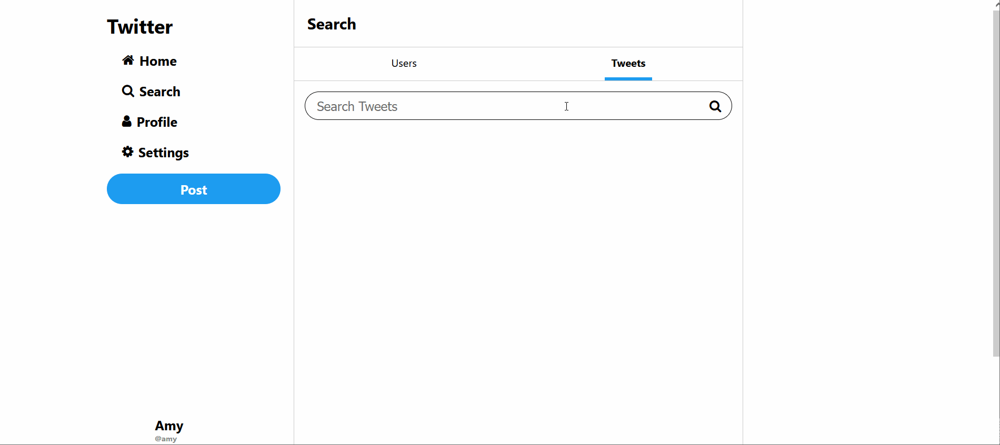

### Profile
- You can see more information about a user on their profile (username, display name, bio, date they joined)
- You can see all the original tweets they made or retweeted on the Posts tab
- You can see all the reply tweets they made on the Replies tab
- You can see all the tweets they liked on the Likes tab
- You can see who they follow and their followers by clicking the Following or Followers link respectively
- You can follow/unfollow them
- If the profile is yours, you can edit your own profile from this page

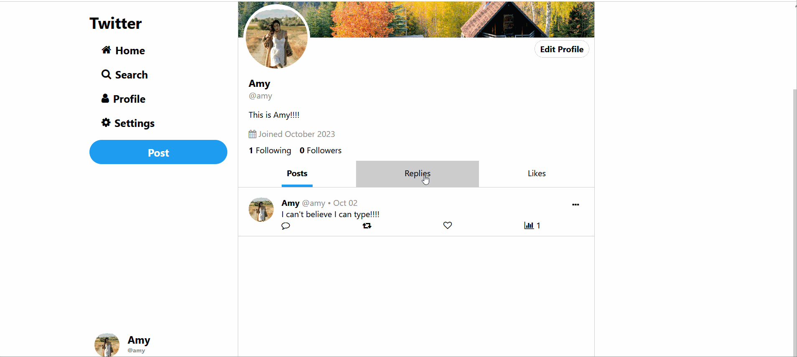
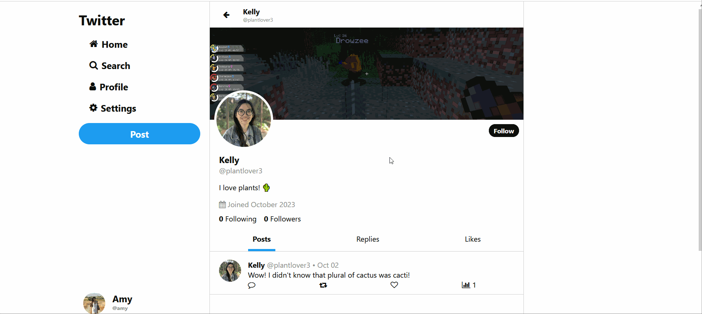
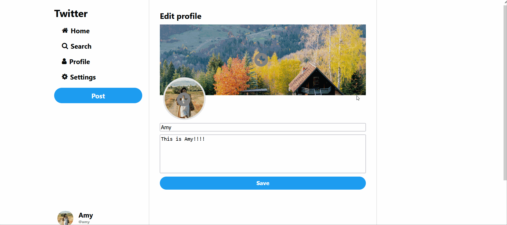
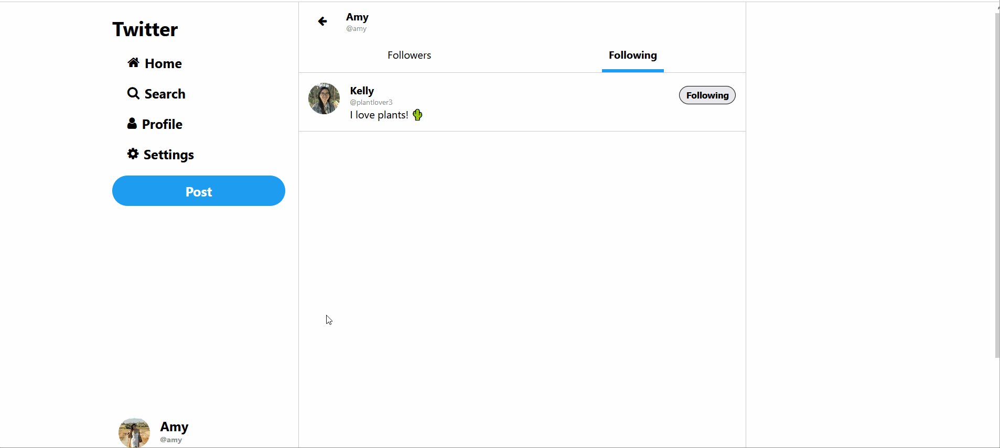
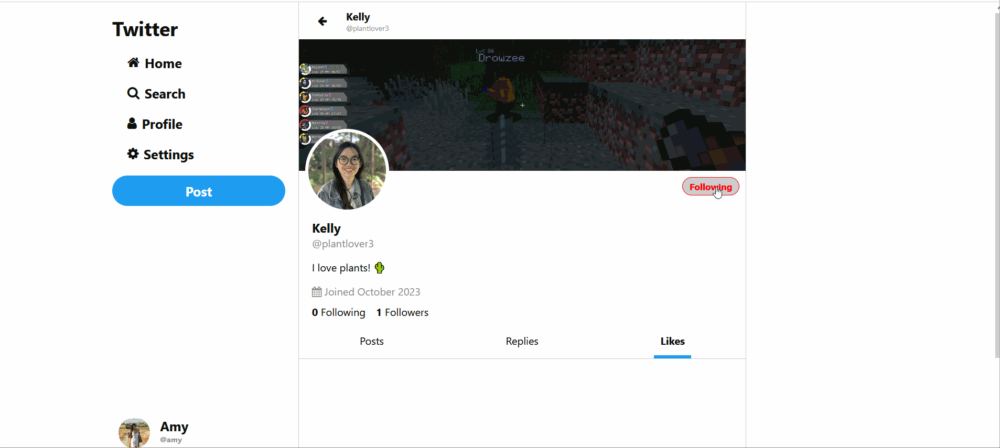

### Settings
- Users can change their username and password 

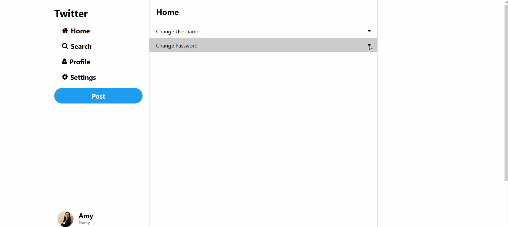

## Planned Features
- Dark Mode
- UI responsiveness for mobile devices

## Set Up
1. Clone the git repository
2. Go to the directory of the project
3. Create a virtual environment with `python -m venv env`
4. Activate the virtual environment using `env\scripts\activate` (windows) or `source env/bin/activate` (Mac/Linux)
5. Install the require dependancies with `pip install -r requirements.txt`
6. Make migrations to the database by first running `python manage.py makemigrations`, then `python.py manage.py migrate`
7. Run the application locally using `python manage.py runserver`

### Notes
- The database is currently defaulting to SQLlite
- Emails are currently being sent to the `sent_email` folder and needs to be configured for deployment
- Images are currently being saved to the `media` folder and needs to be configured for deployment
- The frontend component uses icons from Font Awesome v4.7 and JQuery. Both are imported as CDN, so no installation is required
